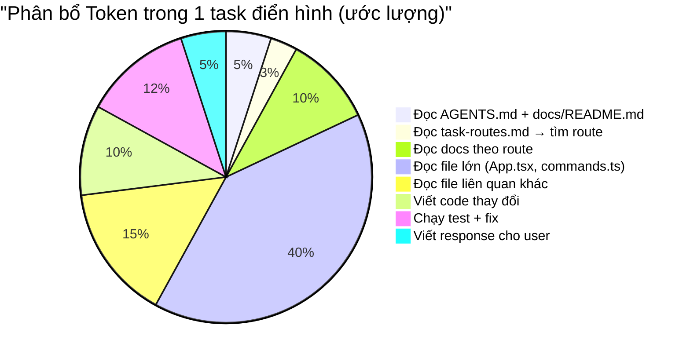
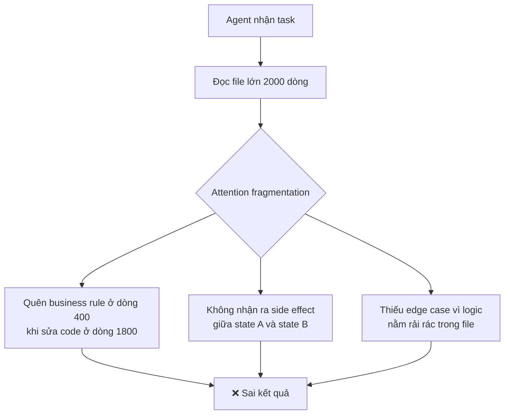
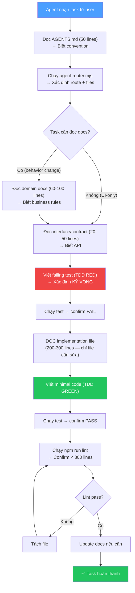

# AI Agent Workflow Optimization: Tối ưu Token, Tối đa Chính xác

## Mục tiêu

Nghiên cứu luồng làm việc tối ưu nhất cho AI agent, đảm bảo:
1. **Token tiêu thụ thấp nhất** — agent đọc ít nhất có thể, chỉ đọc đúng cái cần
2. **Kết quả chính xác** — agent hiểu đúng context, sửa đúng logic, không bỏ sót

---

## Phân tích: Tại sao Agent Tốn Token & Sai?

### Token lãng phí ở đâu?



> **40% token dùng để đọc file lớn** — đây là khoản chi phí lớn nhất và có thể giảm 70-80% sau refactoring.

### Agent sai ở đâu?



---

## 7 Chiến lược Tối ưu

### 1. 🎯 Precision Routing — Đọc đúng file, không đọc thừa

**Vấn đề hiện tại**: Repo đã có `task-routes.md` và `agent-router.mjs` — đây là điểm mạnh rất tốt! Nhưng hầu hết routes đều trỏ về `src/App.tsx` và `electron/backend/commands.ts`, vô hiệu hóa tính precision.

**Sau refactoring (Phase 1-2)**: Routes sẽ trỏ tới file nhỏ (~200-300 lines) → agent chỉ đọc đúng cái cần.

**Before:**
```markdown
### Change Workflow UI Behavior
- Verify: src/App.tsx, src/features/workflows/, ...
# → Agent đọc 2093 lines App.tsx + tất cả features/workflows/
```

**After:**
```markdown
### Change Workflow Graph Editor
- Verify: src/features/workflows/state/useWorkflowGraphState.ts,
          src/features/workflows/components/WorkflowGraphEditor.tsx
# → Agent đọc 200 + 300 = 500 lines. Tiết kiệm 75% token
```

**Cải tiến nâng cao**: Tách các route chung chung thành routes cụ thể hơn:

| Route hiện tại (chung chung) | Routes mới (cụ thể) |
|-----|------|
| "Change Workflow UI Behavior" | "Change Workflow Graph Editor" |
| | "Change Workflow Run Monitor" |
| | "Change Workflow Settings Dialog" |
| | "Change Workflow List Page" |

> [!TIP]
> **Quy tắc vàng**: Route càng cụ thể → agent đọc càng ít file → token càng thấp → chính xác càng cao.

---

### 2. 📜 Contract-First Design — Định nghĩa rõ interface trước khi code

**Vấn đề hiện tại**: Khi agent thêm feature mới, nó phải đọc toàn bộ App.tsx để hiểu "interface" giữa App và child component. Không có contract rõ ràng.

**Giải pháp**: Mỗi domain hook export 1 interface rõ ràng. Agent chỉ cần đọc interface, không cần đọc implementation.

```typescript
// src/features/workflows/state/useWorkflowWorkspace.ts

/** Contract: hook này return gì */
export interface WorkflowWorkspaceAPI {
  // State
  workflows: WorkflowSummary[];
  selectedWorkflowId: string | null;
  detail: WorkflowDetail | null;
  
  // Actions
  loadWorkflows: () => Promise<void>;
  openWorkflow: (id: string) => Promise<void>;
  deleteWorkflow: (id: string) => void;
  duplicateWorkflow: (workflow: WorkflowSummary) => Promise<void>;
}
```

**Tại sao quan trọng?**
- Agent muốn thêm button "Run Workflow" trong `WorkflowListPage.tsx`
- **Không có contract**: Agent phải đọc hết App.tsx (2093 lines) để tìm function `runSavedWorkflow`
- **Có contract**: Agent đọc interface `WorkflowRunStateAPI` (~20 lines), thấy `runWorkflow: (id) => Promise<void>`, dùng luôn

**Token savings**: ~2000 lines → ~20 lines = **99% reduction** cho mỗi lần tra cứu API.

---

### 3. 📦 Progressive Context Loading — Đọc từ trừu tượng đến chi tiết

**Nguyên tắc**: Agent nên đọc theo thứ tự: Summary → Interface → Implementation. Dừng sớm nhất có thể.

```
Level 0: AGENTS.md (50 lines)           → Biết project gì, convention gì
Level 1: task-routes.md (104 lines)     → Biết đọc file nào cho task này
Level 2: Domain docs (60-100 lines)     → Biết business rules
Level 3: Interface/Types (~20-50 lines) → Biết API contract
Level 4: Implementation (~200 lines)    → Chỉ đọc khi THỰC SỰ cần sửa
```

**Hiện tại**: Agent thường nhảy thẳng Level 0 → Level 4 (đọc hết App.tsx). Sau refactoring + có contract, agent có thể dừng ở Level 3 cho nhiều task.

**Ví dụ**:
- Task: "Thêm nút duplicate workflow vào WorkflowListPage"
- Level 0: AGENTS.md → biết feature-based structure
- Level 1: task-routes.md → "Change Workflow UI" → verify `WorkflowListPage.tsx`
- Level 2: Không cần đọc domain docs (UI-only change)
- Level 3: Đọc `WorkflowWorkspaceAPI` interface → thấy `duplicateWorkflow()`
- Level 4: Đọc `WorkflowListPage.tsx` (349 lines) → thêm button, done

**Total tokens**: ~50 + ~30 + ~20 + ~349 = **~450 lines** thay vì ~2500+

---

### 4. ✅ Verification-First Workflow — Test trước, sửa đúng

**Repo đã có**: TDD skill rất mạnh (`test-driven-development/SKILL.md` — 372 lines).

**Nhưng có thể tối ưu hơn**: Thêm **focused verification** vào workflow.

```
┌──────────────────────────────────────────────────────┐
│  Agent Workflow Tối ưu (mỗi task)                    │
│                                                      │
│  1. READ route → xác định scope (< 2 phút)           │
│  2. READ interface/contract (< 1 phút)               │
│  3. WRITE failing test (TDD RED)                     │
│  4. READ implementation file CHỈ KHI cần sửa        │
│  5. WRITE minimal code change (TDD GREEN)            │
│  6. RUN test → verify                                │
│  7. RUN npm run lint → verify không vượt 300 lines   │
│  8. UPDATE docs nếu behavior thay đổi               │
└──────────────────────────────────────────────────────┘
```

**Key insight**: Bước 3 (viết test) TRƯỚC bước 4 (đọc implementation) → agent biết chính xác cần sửa GÌ trước khi đọc code → đọc code có mục đích rõ ràng → không đọc thừa.

---

### 5. 📋 AGENTS.md Optimization — Ngắn gọn, hành động được

**Hiện tại**: AGENTS.md 50 lines — đã tốt! Nhưng có thể tối ưu hơn.

**Nguyên tắc**: AGENTS.md nên < 80 lines. Mỗi dòng phải giúp agent HÀNH ĐỘNG, không phải MÔ TẢ.

**Bad** (mô tả):
```markdown
Frontend UI lives in src/App.tsx, src/App.css, src/layouts/, and src/features/workflows/
```

**Good** (hành động):
```markdown
## Where To Put Code
- New UI state/logic → src/features/{domain}/state/useXxxWorkspace.ts
- New UI component → src/features/{domain}/components/
- New backend command → electron/backend/commands/{domain}Commands.ts  
- NEVER add to src/app/App.tsx (composition root only)
```

**Tác động**: Agent đọc AGENTS.md ở mỗi task (bắt buộc). Nếu AGENTS.md cho hành động rõ ràng, agent không cần "suy nghĩ" thêm → ít token cho reasoning.

---

### 6. 🏗️ File Architecture cho Minimal Reads

**Nguyên tắc "1 file = 1 reason to read"**:

Mỗi file nên có 1 lý do duy nhất để agent cần đọc. Nếu agent phải đọc file vì 2 lý do khác nhau → file đó nên tách.

| File hiện tại | Lý do đọc #1 | Lý do đọc #2 | Action |
|---|---|---|---|
| `App.tsx` | Routing logic | Workflow state | Tách |
| `commands.ts` | Workflow commands | Recording commands | Tách |
| `workflowGraph.ts` (1101 lines) | Graph manipulation | Graph rendering helpers | Tách |
| `workflowCore.ts` (973 lines) | Core types | Evidence types | Đã tách |

**Sau refactoring**:
```
Agent task: "Fix bug trong workflow graph"
→ Đọc: useWorkflowGraphState.ts (200 lines) + workflowGraphManipulation.ts (300 lines)
→ KHÔNG cần đọc: useRecordingWorkspace.ts, useSubflowWorkspace.ts, workflowGraphRendering.ts

Token budget: ~500 lines thay vì ~3000+
```

---

### 7. 🚫 Anti-patterns: Những gì ĐANG làm tốn token

| Anti-pattern | Mô tả | Token cost | Fix |
|---|---|---|---|
| **God Component** | App.tsx 2093 lines | ~72KB/task | Tách hooks |
| **God Object** | commands.ts 1509 lines | ~53KB/task | Tách modules |
| **Docs sprawl** | 20+ doc files, agent đọc nhiều route docs | ~15KB/task | Routes cụ thể hơn |
| **No interface** | Agent đọc implementation để hiểu API | ~30KB/task | Contract types |
| **Type mega-file** | workflowCore.ts 973 lines | ~25KB | Tách theo domain |
| **Data-as-code** | 3 help content files > 800 lines | ~20KB nếu agent đọc nhầm | Move to `data/` + exempt |

---

## Áp dụng vào Repo: Action Items Cụ thể

### Tầng 1: Đã có trong Refactoring Plan v2
- ✅ Tách App.tsx → domain hooks (Phase 2)
- ✅ Tách commands.ts → domain modules (Phase 3)
- ✅ ESLint max-lines enforcement (Phase 0)
- ✅ Folder convention (Phase 1)

### Tầng 2: Bổ sung vào Refactoring Plan (NEW)

#### A. Contract Types cho mỗi domain hook
Mỗi hook file export 1 interface mô tả public API:
```typescript
export interface WorkflowWorkspaceAPI { ... }
export function useWorkflowWorkspace(deps: ...): WorkflowWorkspaceAPI { ... }
```
→ Agent đọc interface 20 lines thay vì implementation 250 lines

#### B. Tách task-routes.md thành routes cụ thể hơn
```markdown
### Change Workflow Graph Editor        # Thay vì "Change Workflow UI"
### Change Workflow Run Monitor
### Change Workflow Settings Dialog
### Change Workflow List/Create Flow
### Change Subflow Editor
### Change Recording Flow
```
→ Mỗi route trỏ tới 1-3 file nhỏ thay vì "everything in workflows/"

#### C. Thêm file `ARCHITECTURE_QUICK_REF.md` (~30 lines)
Một "bản đồ nhanh" cho agent khi không chắc file nào:
```markdown
# Quick Reference: Where Is What?

## State Hooks (read these to understand API)
- Workflow CRUD: src/features/workflows/state/useWorkflowWorkspace.ts
- Graph editing: src/features/workflows/state/useWorkflowGraphState.ts
- Run execution: src/features/workflows/state/useWorkflowRunState.ts
- Settings: src/features/workflows/state/useWorkflowSettingsState.ts
- Recording: src/features/workflows/state/useRecordingWorkspace.ts
- Projects: src/features/projects/state/useProjectWorkspace.ts
- Subflows: src/features/subflows/state/useSubflowWorkspace.ts
- Navigation: src/app/useAppNavigation.ts

## Backend Commands (read these to understand backend API)
- Workflow: electron/backend/commands/workflowCommands.ts
- Project: electron/backend/commands/projectCommands.ts
- Subflow: electron/backend/commands/subflowCommands.ts
- Package: electron/backend/commands/packageCommands.ts
- Recording: electron/backend/commands/recordingCommands.ts
- Settings: electron/backend/commands/settingsCommands.ts
```
→ Agent mất 30 lines thay vì grep toàn bộ codebase

#### D. Quy tắc cho AGENTS.md khi thêm feature mới
```markdown
## Adding New Features
When agent adds a new feature that touches multiple layers:
1. Define interface/contract FIRST in the state hook file
2. Write test against the interface
3. Implement hook
4. Wire into App.tsx (1-2 lines only)
5. Add backend command if needed
6. Add route in task-routes.md
```

---

## Workflow Pipeline Tối ưu (Tổng hợp)



### Token Budget ước tính cho 1 task điển hình

| Step | Lines đọc | Tokens (ước lượng) |
|------|-----------|-------------------|
| AGENTS.md | 50 | ~200 |
| agent-router output | 10 | ~40 |
| Domain doc (nếu cần) | 80 | ~320 |
| Interface/contract | 30 | ~120 |
| Test file | 50 | ~200 |
| Implementation file | 250 | ~1000 |
| **Total context input** | **~470** | **~1,880** |
| Code output | ~50 | ~200 |
| **Grand total** | | **~2,080 tokens** |

**So sánh**:
- Hiện tại: ~100K+ tokens/task (đọc App.tsx + commands.ts + nhiều file)
- Sau tối ưu: ~5-10K tokens/task (đọc đúng file nhỏ cần thiết)
- **Giảm: ~90-95%**

---

## Tóm tắt: 3 cột trụ

```
┌──────────────────────────────────────────────────┐
│           AI AGENT EFFICIENCY TRIANGLE            │
│                                                  │
│                   PRECISION                      │
│                   /      \                       │
│                  /        \                      │
│           Routes cụ thể   Contract-first         │
│            task-routes     Interface types        │
│                /              \                  │
│               /                \                 │
│    STRUCTURE ──────────────── VERIFICATION       │
│    Files < 300 lines           TDD workflow      │
│    Feature-sliced design       ESLint enforcement│
│    Domain hooks                Focused tests     │
│    Command modules                               │
└──────────────────────────────────────────────────┘

Precision: Agent biết ĐỌC CÁI GÌ → ít token
Structure: Files nhỏ, tổ chức rõ → đọc NHANH
Verification: Test + lint → kết quả ĐÚNG
```
