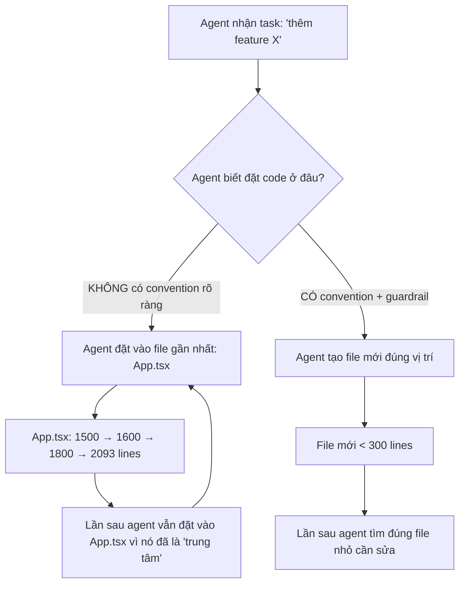
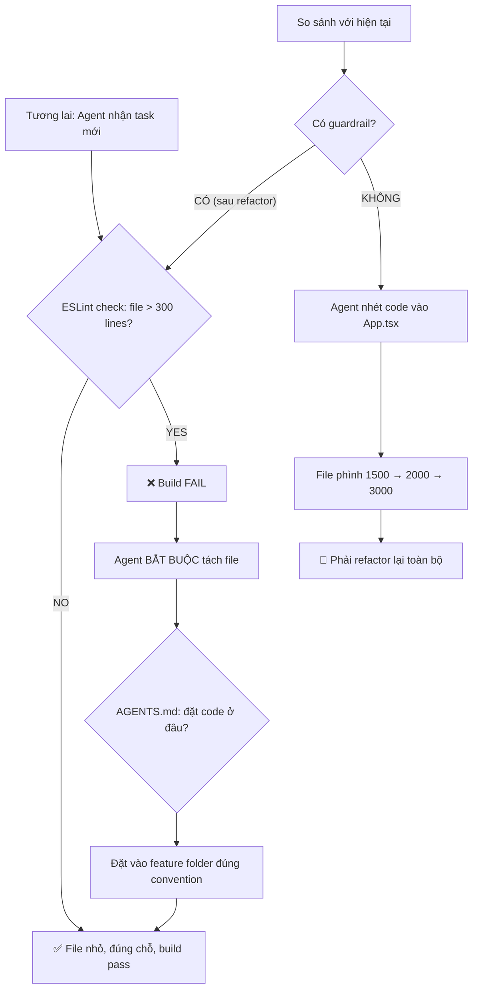

# Refactoring Plan v2: Giải pháp triệt để, không cần refactor lại

## Trả lời thẳng câu hỏi của bạn

### Plan cũ đủ triệt để chưa?

**Chưa.** Plan v1 chỉ giải quyết **triệu chứng** (tách file lớn → file nhỏ) mà không giải quyết **nguyên nhân gốc** khiến file lớn lên. Nếu chỉ tách file mà không có cơ chế ngăn chặn, 6 tháng sau agent sẽ lại dồn code vào 1 file và bạn lại phải refactor.

### Tại sao code bị phình to?



**3 nguyên nhân gốc:**

1. **Không có ESLint guardrail** — repo hiện tại KHÔNG có eslint config nào. Không có gì ngăn agent viết file 2000 dòng
2. **Không có folder convention rõ ràng** — `AGENTS.md` nói "Frontend UI lives in `src/App.tsx`" → agent hiểu App.tsx là nơi đặt mọi thứ
3. **Không có "new feature template"** — agent không biết khi thêm feature mới thì tạo folder/file gì

---

## Giải pháp triệt để: 3 lớp phòng thủ

```
┌─────────────────────────────────────────────────────────┐
│  Layer 3: AUTOMATED ENFORCEMENT (ESLint + CI)           │
│  → File > 300 lines = build FAIL. Agent BẮT BUỘC tách  │
├─────────────────────────────────────────────────────────┤
│  Layer 2: FOLDER CONVENTION (Feature-Sliced)            │
│  → Agent biết chính xác ĐẶT code MỚI ở đâu            │
├─────────────────────────────────────────────────────────┤
│  Layer 1: CODE REFACTORING (Tách file lớn)              │
│  → Dọn dẹp nợ kỹ thuật hiện tại                        │
└─────────────────────────────────────────────────────────┘
```

### Tại sao 3 lớp này triệt để?

- **Chỉ tách file (Layer 1)** = giải pháp tạm, sẽ bị phình lại
- **Thêm folder convention (Layer 2)** = agent biết đặt code đâu, nhưng vẫn có thể "lười" nhét vào file cũ
- **Thêm ESLint enforcement (Layer 3)** = **BẮT BUỘC** agent phải tuân thủ. File > 300 lines → build fail → agent phải tách

---

## Phase 0: Automated Guardrails (Làm TRƯỚC khi refactor)

> [!IMPORTANT]
> Đây là phase quan trọng nhất. Nếu chỉ làm 1 phase, hãy làm phase này. Nó ngăn mọi agent (kể cả agent tương lai) tạo God Component.

### [NEW] `eslint.config.js`
```js
export default [
  {
    files: ["src/**/*.{ts,tsx}", "electron/**/*.ts"],
    rules: {
      // File > 300 lines (excluding blank + comments) = ERROR
      "max-lines": ["error", { 
        max: 300, 
        skipBlankLines: true, 
        skipComments: true 
      }],
      // Function > 80 lines = WARNING 
      "max-lines-per-function": ["warn", { 
        max: 80, 
        skipBlankLines: true, 
        skipComments: true 
      }],
    },
  },
  {
    // Data files, types, and tests are exempt
    files: [
      "src/**/*.test.{ts,tsx}",
      "electron/**/*.test.ts", 
      "src/types/**/*.ts",
      "src/**/data/**/*.ts",
      "src/**/*Content.ts",      // help content = pure data
      "src/**/*Guidance.ts",     // field guidance = pure data
      "src/**/*Defaults.ts",     // defaults = pure data
    ],
    rules: {
      "max-lines": "off",
      "max-lines-per-function": "off",
    },
  },
];
```

### [MODIFY] `package.json` — Thêm lint scripts
```json
{
  "scripts": {
    "lint": "eslint src/ electron/ --max-warnings=0",
    "lint:fix": "eslint src/ electron/ --fix"
  }
}
```

### [MODIFY] `.husky/pre-commit` — Chặn trước khi commit
ESLint chạy tự động trước mỗi commit. Agent không thể bypass.

### [MODIFY] `AGENTS.md` — Thêm hard rule
```markdown
## File Size Limits (ENFORCED BY ESLINT)
- Source files: **max 300 lines** (excluding blanks + comments)
- When a file approaches 300 lines, split it BEFORE adding more code
- Data/content files, type definitions, and tests are exempt
- Run `npm run lint` before committing — build will FAIL if exceeded
```

---

## Phase 1: Folder Convention — Feature-Sliced Design

### Cấu trúc folder mới

Hiện tại repo đã có `src/features/` pattern khá tốt, nhưng thiếu consistency. Đề xuất chuẩn hóa:

```
src/
├── app/                          # [NEW] App shell — replaces root-level App.tsx
│   ├── App.tsx                   # < 100 lines: chỉ compose hooks + routing
│   ├── AppProviders.tsx          # Global context providers (error, toast)
│   └── useAppNavigation.ts       # Screen routing + sidebar state
│
├── features/                     # Mỗi feature là mini-app tự chứa
│   ├── workflows/
│   │   ├── state/                # [NEW] Domain hooks
│   │   │   ├── useWorkflowWorkspace.ts
│   │   │   ├── useWorkflowGraphState.ts
│   │   │   ├── useWorkflowRunState.ts
│   │   │   ├── useWorkflowSettingsState.ts
│   │   │   └── useRecordingWorkspace.ts
│   │   ├── components/           # UI components (giữ nguyên, đã tốt)
│   │   ├── pages/                # Page-level components (giữ nguyên)
│   │   ├── lib/                  # Pure logic/utils (giữ nguyên)
│   │   └── data/                 # [NEW] Tách pure data ra khỏi lib/
│   │       ├── graphNodeHelpContent.ts
│   │       ├── stepHelpContent.ts
│   │       ├── stepHelpFieldGuidance.ts
│   │       └── paletteDefinitions.ts
│   │
│   ├── projects/
│   │   ├── state/                # [NEW]
│   │   │   └── useProjectWorkspace.ts
│   │   ├── components/
│   │   └── pages/
│   │
│   ├── subflows/                 # [NEW] Tách từ workflows, vì subflow là domain riêng
│   │   ├── state/
│   │   │   └── useSubflowWorkspace.ts
│   │   ├── components/           # Subflow-specific components
│   │   └── pages/
│   │       ├── SubflowListPage.tsx
│   │       └── SubflowDetailPage.tsx
│   │
│   ├── evidence/                 # Giữ nguyên, đã tốt
│   ├── identities/               # Giữ nguyên, đã tốt
│   ├── overview/                 # Giữ nguyên, đã tốt
│   ├── schedules/                # Giữ nguyên, đã tốt
│   └── settings/                 # Giữ nguyên, đã tốt
│
├── shared/                       # [NEW] Rename từ lib/ + components/
│   ├── hooks/                    # Cross-feature hooks
│   │   ├── useGraphExitNavigation.ts
│   │   └── useAppPackageDialogs.ts
│   ├── lib/                      # Cross-feature utils
│   │   ├── workflowApi.ts
│   │   ├── workflowUi.ts
│   │   ├── appState.ts
│   │   └── actionCapabilities.ts
│   ├── components/               # Shared UI components
│   │   └── ui/
│   └── types/                    # Shared types
│       ├── workflow.ts           # Re-export barrel
│       ├── workflowCore.ts
│       ├── workflowGraphOps.ts
│       └── workflowEvidenceRecording.ts
│
├── layouts/                      # Giữ nguyên
└── styles/                       # Giữ nguyên
```

Backend:
```
electron/
├── backend/
│   ├── commands/                 # [NEW] Tách từ commands.ts
│   │   ├── index.ts              # Orchestrator < 150 lines
│   │   ├── types.ts              # CommandDependencies type
│   │   ├── workflowCommands.ts   # Workflow CRUD + run
│   │   ├── projectCommands.ts    # Project + environment CRUD
│   │   ├── subflowCommands.ts    # Subflow CRUD
│   │   ├── packageCommands.ts    # Import/export packages
│   │   ├── recordingCommands.ts  # Recording sessions
│   │   └── settingsCommands.ts   # Settings + diagnostics
│   ├── actions/                  # Giữ nguyên
│   ├── browser/                  # Giữ nguyên
│   ├── graph/                    # Giữ nguyên
│   ├── persistence/              # Giữ nguyên
│   ├── runtime/                  # Giữ nguyên
│   └── ...
```

### Quy tắc folder cho AGENTS.md

```markdown
## New Feature Checklist
When adding a new feature, create this structure:
  src/features/{feature-name}/
    state/        — domain hooks (useXxxWorkspace.ts)
    components/   — UI components
    pages/        — page-level components  
    lib/          — pure logic/utils
    data/         — pure data (no logic, exempt from line limits)

NEVER add state or business logic directly to App.tsx.
App.tsx is a COMPOSITION ROOT only — it calls hooks and renders pages.
```

> [!IMPORTANT]
> **Tại sao convention này ngăn refactor lại?**
> - Agent nhận task "thêm feature Y" → `AGENTS.md` nói tạo `src/features/Y/`
> - Agent nhận task "sửa feature X" → `task-routes.md` trỏ tới `src/features/X/state/`
> - ESLint ngăn file vượt 300 lines → agent tự tách
> - Kết quả: agent tự tuân theo kiến trúc, không cần human refactor

---

## Phase 2: Tách App.tsx → Composition Root

### Before vs After

**Before (2093 lines):**
```
App.tsx
├── 47 useState declarations
├── 78 functions (business logic for ALL domains)
├── ~350 lines JSX (routing + dialogs)
└── Everything coupled together
```

**After (~150 lines):**
```
app/App.tsx (composition root)
├── Import 8 domain hooks
├── Wire hooks together via props
├── Render screen router
└── Render global dialogs

features/workflows/state/useWorkflowWorkspace.ts (~250 lines)
features/workflows/state/useWorkflowGraphState.ts (~200 lines)
features/workflows/state/useWorkflowRunState.ts (~180 lines)
features/workflows/state/useWorkflowSettingsState.ts (~250 lines)
features/workflows/state/useRecordingWorkspace.ts (~150 lines)
features/projects/state/useProjectWorkspace.ts (~200 lines)
features/subflows/state/useSubflowWorkspace.ts (~200 lines)
app/useAppNavigation.ts (~200 lines)
```

### Concrete file breakdown:

#### [NEW] `src/app/App.tsx` — ~150 lines
```tsx
function App() {
  const toast = useToast();
  const nav = useAppNavigation();
  const projects = useProjectWorkspace({ toast });
  const workflows = useWorkflowWorkspace({ toast, projects });
  const graph = useWorkflowGraphState({ workflows });
  const settings = useWorkflowSettingsState({ workflows });
  const runs = useWorkflowRunState({ workflows });
  const subflows = useSubflowWorkspace({ toast, projects });
  const recording = useRecordingWorkspace({ toast, workflows });
  // ... existing hooks that are already extracted
  const evidence = useEvidenceWorkspace({ setAppError });
  const schedules = useSchedulesWorkspace({ setAppError });
  const identities = useIdentityLabWorkspace({ ... });

  return (
    <AppShell activeItem={nav.activeItem} ...>
      <ScreenRouter screen={nav.screen} ... />
      <GlobalDialogs ... />
    </AppShell>
  );
}
```

#### [NEW] `src/features/workflows/state/useWorkflowWorkspace.ts`
State hiện tại ở App.tsx lines 133-188, 412-798:
- `workflows`, `selectedWorkflowId`, `detail`, `workflowGraph`  
- `workflowDialogMode`, `editingWorkflowId`, `workflowNameDraft`
- `deleteWorkflowCandidate`, `deleteBrowserProfileData`
- Functions: `loadWorkflows`, `openWorkflow`, `performOpenWorkflow`, `createProject`, `deleteWorkflow`, `duplicateWorkflow`, `submitWorkflowDialog`...

#### [NEW] `src/features/workflows/state/useWorkflowGraphState.ts`
State hiện tại ở App.tsx lines 170-180, 344-410, 1546-1557:
- `graphRevision`, `savedGraphRevision`, `graphSaveStatus`, `graphIssues`, `selectedGraphNodeId`
- `graphAutosaveEnabled`, autosave useEffect
- Functions: `changeWorkflowGraph`, `persistCurrentGraph`, `validateGraph`, `saveGraph`

#### [NEW] `src/features/workflows/state/useWorkflowSettingsState.ts`
State hiện tại ở App.tsx lines 156-169, 1108-1186, 1559-1682:
- `workflowSettings`, `workflowSettingsSavedSnapshot`
- `workflowSettingsDialogOpen`, `workflowSettingsActiveSection`
- `workflowSettingsSaveStatuses`, `workflowProfileDraftId`, `workflowProfileSavedId`
- Functions: `persistWorkflowSettingsSection`, `changeWorkflowSettings`, `openWorkflowSettings`, `discardWorkflowSettingsChanges`

#### [NEW] `src/features/workflows/state/useWorkflowRunState.ts`
State hiện tại ở App.tsx lines 181-184, 360-368, 572-638, 1188-1295:
- `runState`, `runSnapshots`, `activeRunWorkflowName`
- Run polling useEffect
- Functions: `refreshRunStates`, `upsertRunSnapshot`, `runGraph`, `runSavedWorkflow`, `runGraphFromSelectedNode`, `stopRun`

#### [NEW] `src/features/workflows/state/useRecordingWorkspace.ts`
State hiện tại ở App.tsx lines 189-195, 989-1087:
- `recordingSession`, `recordingDraft`, `recordingWorkflowName`, `recordingBusy`
- Functions: `startWorkflowRecording`, `stopWorkflowRecording`, `discardWorkflowRecording`, `updateRecordingStep`, `saveReviewedRecording`

#### [NEW] `src/features/projects/state/useProjectWorkspace.ts`
State hiện tại ở App.tsx lines 134-138, 417-570:
- `projects`, `selectedProjectId`, `projectCollection`, `projectEnvironments`
- Functions: `loadProjectModel`, `selectProject`, `createProject`, `updateProject`, `deleteProject`, `duplicateProject`, `currentProjectId`, `ensureProjectId`

#### [NEW] `src/features/subflows/state/useSubflowWorkspace.ts`
State hiện tại ở App.tsx lines 139-149, 468-487, 840-987:
- `subflows`, `subflowsLoading`, `selectedSubflow`, `selectedSubflowGraph`
- `selectedSubflowUsage`, `subflowBackTarget`, `subflowGraphSaveStatus`
- Functions: `loadSubflowsForProject`, `openSubflowDetail`, `createProjectSubflow`, `deleteProjectSubflow`, `changeSubflowGraph`, `saveCurrentSubflowGraph`

#### [NEW] `src/app/useAppNavigation.ts`
State hiện tại ở App.tsx lines 131, 150, 1297-1531:
- `screen`, `sidebarCollapsed`, `overviewFocus`
- Functions: `openProjects`, `openOverview`, `openSettings`, `openSchedules`, `openEvidence`, `openIdentities`, `navigateToMissionControlTarget`, `backToList`, `backFromSubflowDetail`

---

## Phase 3: Tách commands.ts → Domain Command Modules

#### [NEW] `electron/backend/commands/types.ts` — ~50 lines
```ts
export type CommandDependencies = {
  repository: WorkflowRepository;
  scheduleRepository: WorkflowScheduleRepository;
  operationsRepository: OperationsRepository;
  evidenceRepository: EvidenceRepository;
  identityRepository: IdentityRepository;
  settingsService: WorkflowSettingsService;
  runManager: RunManager;
  recorderSessionManager: RecorderSessionManager;
  packageService: WorkflowPackageService;
  projectPackageService: ProjectPackageService;
  projectCascades: ReturnType<typeof createProjectCommandCascades>;
  recordingDraftCommands: ReturnType<typeof createRecordingDraftCommands>;
  context: CommandContext;
  // Shared helper functions
  requireWorkflow: (id: string) => WorkflowSummary;
  requireProject: (id: string) => Project;
  getSettings: (workflowId: string) => WorkflowSettings;
  saveSettings: (workflowId: string, settings: WorkflowSettings) => WorkflowSettings;
  getWorkflowGraph: (workflowId: string) => WorkflowGraph;
  createWorkflow: (name: string, options?: WorkflowCreateOptions) => Workflow;
  activeRunConflict: (workflowId: string, settings: WorkflowSettings) => { message: string; field: string } | null;
};
```

#### [NEW] `electron/backend/commands/workflowCommands.ts` — ~250 lines
#### [NEW] `electron/backend/commands/projectCommands.ts` — ~200 lines
#### [NEW] `electron/backend/commands/subflowCommands.ts` — ~150 lines
#### [NEW] `electron/backend/commands/packageCommands.ts` — ~200 lines
#### [NEW] `electron/backend/commands/recordingCommands.ts` — ~100 lines
#### [NEW] `electron/backend/commands/settingsCommands.ts` — ~200 lines

#### [MODIFY] `electron/backend/commands.ts` → `electron/backend/commands/index.ts` — ~200 lines
Chỉ còn dependency construction + compose:
```ts
export function createWorkflowCommandHandlers(context: CommandContext) {
  // Build dependencies (~100 lines, giữ nguyên logic hiện tại)
  const deps = buildDependencies(context);
  
  return {
    ...createWorkflowCommands(deps),
    ...createProjectCommands(deps),
    ...createSubflowCommands(deps),
    ...createPackageCommands(deps),
    ...createRecordingCommands(deps),
    ...createSettingsCommands(deps),
    ...createScheduleCommandHandlers({ ... }),
  };
}
```

---

## Phase 4: Update Agent Docs — Đảm bảo tương lai không lặp lại

### [MODIFY] `AGENTS.md`

Thêm các sections sau:

```markdown
## File Size Limits (ENFORCED BY ESLINT)
- Source files: max 300 lines (excluding blanks + comments)  
- Tests and pure data files: exempt
- Run `npm run lint` before committing
- If ESLint fails on max-lines, split the file — do NOT increase the limit

## Where To Put New Code

### Frontend feature code
- State/hooks: `src/features/{domain}/state/`
- Components: `src/features/{domain}/components/`
- Pages: `src/features/{domain}/pages/`
- Pure data: `src/features/{domain}/data/`
- Pure logic: `src/features/{domain}/lib/`

### Backend command code
- New commands: `electron/backend/commands/{domain}Commands.ts`
- New services: `electron/backend/services/`
- New repositories: `electron/backend/persistence/`

### NEVER
- Add state or business logic to `src/app/App.tsx`
- Add command handlers directly to `electron/backend/commands/index.ts`
- Create a new file in `src/lib/` — use `src/shared/lib/` or feature-scoped `lib/`

## New Feature Checklist
When adding a new domain feature:
1. Create `src/features/{name}/` with `state/`, `components/`, `pages/`
2. Create `useXxxWorkspace.ts` hook in `state/`
3. Wire the hook into `src/app/App.tsx`
4. Add backend commands in `electron/backend/commands/{name}Commands.ts`
5. Add route in `docs/task-routes.md`
6. Run `npm run lint` to verify all files < 300 lines
```

### [MODIFY] `docs/task-routes.md`
Cập nhật tất cả routes để trỏ tới file mới thay vì `src/App.tsx` và `electron/backend/commands.ts`.

Ví dụ:
```markdown
### Change Workflow UI Behavior
- **Read**: `domain/workflow-lifecycle.md`, ...
- **Verify**: `src/features/workflows/state/`, `src/features/workflows/components/`, ...
- **DO NOT** modify `src/app/App.tsx` unless adding a new top-level hook
```

---

## Tại sao giải pháp này không cần refactor lại?



### Bảng so sánh

| Tình huống | Không có guardrail (hiện tại) | Có guardrail (sau refactor) |
|------------|-------------------------------|----------------------------|
| Agent thêm feature mới | Nhét vào App.tsx | Tạo feature folder mới |
| File đạt 300 lines | Tiếp tục thêm → 500 → 1000 | ESLint fail → agent tự tách |
| Agent sửa feature X | Đọc 2093 lines App.tsx | Đọc ~200 lines hook file |
| 6 tháng sau | Phải refactor lại | Kiến trúc tự duy trì |
| Agent mới join | Không biết convention | Đọc AGENTS.md, biết ngay |

---

## Open Questions

> [!IMPORTANT]
> 1. **Thứ tự thực hiện**: Tôi đề xuất Phase 0 → Phase 1 → Phase 2 → Phase 3 → Phase 4. Phase 0 (ESLint) nên làm trước để có guardrail ngay. Nhưng vì code hiện tại đã vi phạm max-lines, nên ESLint rule sẽ được set ở `warn` trước, rồi chuyển sang `error` sau khi tách file xong. Bạn đồng ý không?

> [!IMPORTANT]
> 2. **Scope**: Đây là refactoring lớn. Bạn muốn làm hết trong 1 lần (dài, rủi ro cao), hay chia nhỏ (Phase 0 trước, validate, rồi Phase 1, validate, ...)?

> [!IMPORTANT]
> 3. **`src/app/` vs giữ `src/App.tsx`**: Di chuyển App.tsx vào `src/app/App.tsx` sẽ tạo folder structure rõ ràng hơn nhưng phải update import paths. Hay giữ `src/App.tsx` tại chỗ nhưng chỉ làm composition root?

> [!IMPORTANT]
> 4. **Subflows**: Hiện subflows nằm trong `src/features/workflows/`. Tôi đề xuất tách ra `src/features/subflows/` vì nó là domain riêng. Bạn có đồng ý không?

## Verification Plan

### Automated Tests
```bash
npm run lint          # ESLint max-lines check
npm test              # Full test suite
npx tsc --noEmit      # TypeScript type check
npm run build         # Full build
```

### Manual Verification
- Electron app chạy bình thường
- Tất cả navigation flows hoạt động
- Workflow CRUD, graph editing, run execution không bị ảnh hưởng

## Expected Long-term Outcomes

| Metric | Hiện tại | Sau refactor | 6 tháng sau (dự kiến) |
|--------|----------|-------------|----------------------|
| App.tsx lines | 2,093 | ~150 | ~150 (ESLint enforced) |
| commands.ts lines | 1,509 | ~200 | ~200 (ESLint enforced) |
| Max file size | Không giới hạn | 300 (enforced) | 300 (enforced) |
| Token per task | ~100K+ | ~20-30K | ~20-30K (stable) |
| Cần refactor lại? | — | — | **KHÔNG** |
